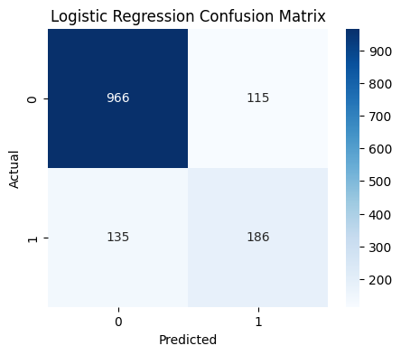
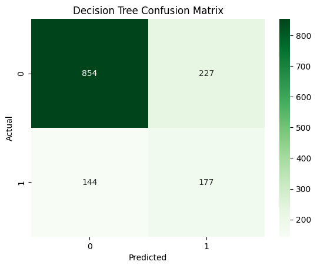
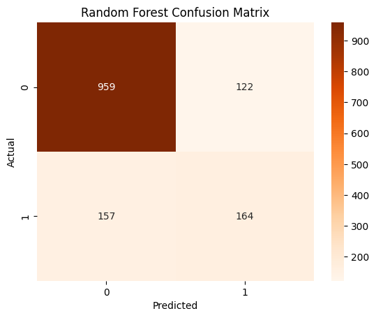

#  Customer Churn Prediction

A Machine Learning project that predicts whether a telecom customer is likely to churn using customer demographics, account information, and service usage.

---
##  Project Overview

Customer churn prediction helps telecom companies identify customers who are likely to leave their service.

In this project I:

- Cleaned and preprocessed the dataset
- Performed Exploratory Data Analysis (EDA)
- Encoded categorical variables
- Trained multiple Machine Learning models
- Compared model performance
- Saved the best performing model for future predictions

---

##  Technologies Used

- Python
- Pandas
- NumPy
- Matplotlib
- Seaborn
- Scikit-learn
- Jupyter Notebook

---

## Project Structure

```
Customer-Churn-Prediction/
│
├── data/
│   ├── raw/
│   └── processed/
│
├── models/
│   └── churn_prediction_model.pkl
│
├── notebooks/
│   └── customer_churn_prediction.ipynb
│
├── reports/
│   └── figures/
│       ├── LogisticRegressionCM.png
│       ├── DecisionTreeCM.png
│       └── RandomForestCM.png
│
├── README.md
├── requirements.txt
└── .gitignore
```

---

##  Model Performance

| Model | Accuracy |
|--------|----------|
| Logistic Regression | 82.17% |
| Decision Tree | 73.54% |
| Random Forest | 80.10% |
| Tuned Random Forest | **81.74%** |

---

## 📊 Confusion Matrices

### Logistic Regression



---

### Decision Tree



---

### Random Forest



---

## 🚀 Future Improvements

- Hyperparameter tuning using GridSearchCV
- Deploy using Flask
- Build a Streamlit Web App
- Add SHAP Explainability
- Deploy on Render

---

## 👨‍💻 Author

**Rushil Moota**

B.Tech Computer Science (Data Science)
